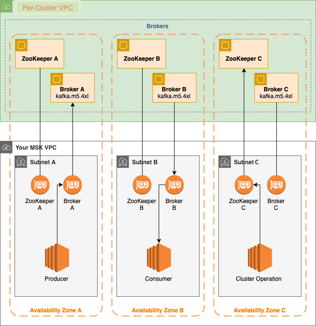

## Requisitos

- Instale sempre as versões mais recentes para ter acesso a todas as funcionalidades.
- Exemplos de instalações para o sistema UBUNTU/Linux. Caso necessário, consulte na web sobre o seu sistema.
  
------------------------------------------------------------------------------------------------------------------------------------------------------------
| Tool                                                                                 | Version               |  Language          |
| ---------                                                                            | -------               | ------------------ |
| [Git](https://learn.hashicorp.com/tutorials/terraform/install-cli)                   | v2.30.1               |                    |
| [Aws cli](https://docs.aws.amazon.com/pt_br/cli/latest/userguide/install-linux.html) | v2.4.18               |                    |
| [Terraform](https://learn.hashicorp.com/tutorials/terraform/install-cli)             | v1.2.8                |                    |
| [Kubectl](https://v1-18.docs.kubernetes.io/docs/tasks/tools/install-kubectl/)        | v1.23.5               |                    |
------------------------------------------------------------------------------------------------------------------------------------------------------------
## Primeiros passos

- 1 Verifique as instalações dos requisitos.

  2 Usando o git, clone em sua máquina o repositório onde se encontram os arquivos terraform (.tf) do projeto.

- 3 - Configure o aws cli com o comando "aws configure" e entre com as credenciais de acesso (access key e secret access key). Com isso, poderá posteriormente enxergar e manipular o cluster remotamente.

### Criar Amazon Managed Streaming para Apache Kafka
- Criar MSK com Terraform.
- Acessar diretório  kafka/terraform_kafka/ 

```bash
terraform init
terraform plan
terraform apply
```


